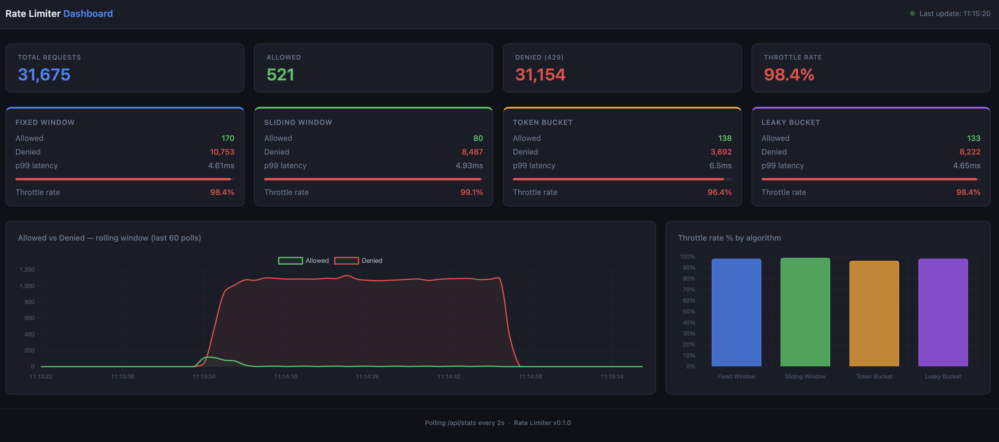

# API Rate Limiter

A production-grade rate limiting library built with FastAPI and Redis. Implements 4 algorithms as pluggable FastAPI middleware, backed by atomic Redis Lua scripts to guarantee correctness under concurrent load.

## Features

- **4 algorithms** — Fixed Window, Sliding Window, Token Bucket, Leaky Bucket
- **Pluggable backends** — Redis (production), In-Memory (tests/dev)
- **One-line decorator** — `@rate_limit(limit=100, window=60, algorithm="token_bucket")`
- **Per-IP, per-API-key, per-user** scoping
- **Atomic under concurrency** — Redis Lua scripts, no race conditions
- **Standard HTTP headers** — `X-RateLimit-Limit`, `X-RateLimit-Remaining`, `X-RateLimit-Reset`, `Retry-After`
- **Prometheus metrics** — `/metrics` endpoint with request counters and latency histograms
- **IP whitelist** — bypass rate limiting for trusted callers

## Quick Start

```bash
# Start the server + Redis
docker compose up --build

# Try it
curl http://localhost:8000/api/token
curl http://localhost:8000/metrics
```

## Usage

```python
from rate_limiter.middleware.rate_limit import rate_limit

# Per-IP, token bucket with burst
@app.get("/api/data")
@rate_limit(limit=100, window=60, algorithm="token_bucket", key_by="ip", burst=20)
async def my_route(request: Request):
    return {"data": "..."}

# Per-API-key, sliding window (no boundary burst)
@app.get("/api/write")
@rate_limit(limit=10, window=60, algorithm="sliding_window", key_by="api_key")
async def write_route(request: Request):
    return {"ok": True}

# Per-user, leaky bucket (strict constant rate)
@app.get("/api/action")
@rate_limit(limit=5, window=60, algorithm="leaky_bucket", key_by="user")
async def action_route(request: Request):
    return {"queued": True}
```

**Global middleware** (applies to all routes):

```python
app.add_middleware(RateLimitMiddleware, limit=1000, window=60, algorithm="fixed_window")
```

## Algorithms

| Algorithm      | Memory                   | Burst                   | Use when                           |
| -------------- | ------------------------ | ----------------------- | ---------------------------------- |
| Fixed Window   | Very low                 | Boundary burst possible | Internal APIs, high traffic        |
| Sliding Window | High (1 key per request) | None                    | Auth endpoints, financial APIs     |
| Token Bucket   | Low                      | Configurable            | Public APIs, smoothing spikes      |
| Leaky Bucket   | Low                      | None                    | Protecting slow downstream systems |

### Fixed Window

Divides time into fixed-size buckets. Counter resets at each boundary. Fast (1–2 Redis ops) but allows 2× limit at window edges.

```
Key: rl:fixed:ip:1.2.3.4:/api/data:1718000000
Value: counter (integer)
Ops: INCR + EXPIRE (on first request only)
```

### Sliding Window Log

Stores every request timestamp in a Redis sorted set. Rolling window with perfect accuracy — no boundary burst possible.

```
Key: rl:sliding:ip:1.2.3.4:/api/data
Value: sorted set of timestamps
Ops: ZREMRANGEBYSCORE + ZCARD + ZADD + EXPIRE
```

### Token Bucket

Tokens refill at a constant rate. Allows brief bursts up to `capacity + burst`. Uses an atomic Lua script to prevent race conditions.

```
Key: rl:token:ip:1.2.3.4:/api/data
Value: "tokens:last_refill_time"
Ops: GET + Lua (refill, check, SET) — atomic
```

### Leaky Bucket

Models a queue that drains at a constant rate. Requests are admitted until the queue is full. No burst allowed.

```
Key: rl:leaky:ip:1.2.3.4:/api/data
Value: "queue_size:last_drain_time"
Ops: GET + Lua (drain, check, SET) — atomic
```

## HTTP Headers

Every response includes:

```
X-RateLimit-Limit: 100          # total requests allowed per window
X-RateLimit-Remaining: 42       # requests left in current window
X-RateLimit-Reset: 1718000060   # unix timestamp when window resets
Retry-After: 15                 # seconds until next request allowed (on 429 only)
```

## Configuration

Via environment variables or `.env` file:

```env
REDIS_URL=redis://localhost:6379/0
DEFAULT_REQUESTS=100
DEFAULT_WINDOW_SECONDS=60
DEFAULT_ALGORITHM=token_bucket
WHITELISTED_IPS=127.0.0.1,::1,10.0.0.0/8
METRICS_ENABLED=true
```

## Running Tests

```bash
# All 79 unit tests
uv run pytest tests/unit/ -v

# Concurrent correctness tests only
uv run pytest tests/unit/test_concurrent.py -v

# Load test (requires running server)
docker compose up -d
uv run locust -f tests/load/locustfile.py --headless \
    -u 50 -r 10 -t 30s --host http://localhost:8000 \
    --html tests/load/report.html

# Open the HTML report
open tests/load/report.html        # macOS
xdg-open tests/load/report.html   # Linux
```

The load test report is saved to [`tests/load/report.html`](tests/load/report.html) — open it in any browser after the run completes. It shows request rate, p50/p95/p99 latencies, and failure breakdown per endpoint.

## Dashboard

Open `http://localhost:8000/dashboard` after starting the server. It polls `/api/stats` every 2 seconds and shows:

- Live allowed vs denied counts per algorithm
- Rolling line chart of traffic over time
- Throttle rate % bar chart
- p99 latency per algorithm



Generate traffic to see it update:

```bash
# Run this while the dashboard is open
watch -n 0.5 'curl -s http://localhost:8000/api/token \
  -H "X-Forwarded-For: 10.0.0.1" > /dev/null && \
  curl -s http://localhost:8000/api/fixed \
  -H "X-Forwarded-For: 10.0.0.1" > /dev/null'
```

Or run the Locust load test — the dashboard will update live as traffic flows through.

## Architecture

```
src/rate_limiter/
├── config.py               # Settings via pydantic-settings
├── main.py                 # FastAPI app + demo routes
├── algorithms/
│   ├── base.py             # RateLimitResult + BaseAlgorithm
│   ├── fixed_window.py     # INCR + EXPIRE
│   ├── sliding_window.py   # Sorted set (ZADD/ZCARD/ZREMRANGEBYSCORE)
│   ├── token_bucket.py     # Lua: refill on elapsed time, allow/consume
│   └── leaky_bucket.py     # Lua: drain on elapsed time, queue/reject
├── backends/
│   ├── base.py             # Abstract interface
│   ├── redis.py            # Production (redis.asyncio + hiredis)
│   └── memory.py           # Tests/dev (asyncio.Lock)
├── middleware/
│   └── rate_limit.py       # @rate_limit decorator + RateLimitMiddleware
└── api/
    └── metrics.py          # Prometheus counters + histograms
```

## Concurrency Design

The critical correctness property: under N concurrent requests, exactly `limit` are allowed and `N - limit` are denied — no over-admission.

**Fixed Window** uses Redis `INCR` which is atomic by definition. Multiple concurrent requests each get a unique monotonically increasing count back. No Lua needed.

**Sliding Window** relies on the sequence `ZREMRANGEBYSCORE → ZCARD → ZADD` running in the right order. The in-memory backend uses `asyncio.Lock` to serialize. In production Redis this is safe because individual commands are atomic and the sequence is fast enough that the window doesn't shift meaningfully between ops.

**Token Bucket and Leaky Bucket** both use Lua scripts via `EVAL`. Redis executes Lua atomically — the entire script runs before any other command is processed. This makes the read-compute-write cycle race-condition-free regardless of concurrency.

## Redis Key Storage

How many keys each algorithm stores and how much memory they use:

| Algorithm      | Keys per user | Key TTL                          | Memory per user                           |
| -------------- | ------------- | -------------------------------- | ----------------------------------------- |
| Fixed Window   | 1 per window  | `window + 1s`                    | ~50 bytes                                 |
| Sliding Window | 1 always      | `window + 10s`                   | ~40 bytes + 20 bytes × requests in window |
| Token Bucket   | 1 always      | `(capacity / refill_rate) + 10s` | ~60 bytes                                 |
| Leaky Bucket   | 1 always      | `(capacity / leak_rate) + 10s`   | ~60 bytes                                 |

**Fixed Window** creates a new key every window period (e.g. one key per 60 seconds per user). Old keys auto-expire. At any time there's at most 1 active key per user per route. Value is a single integer counter.

```
rl:fixed:ip:1.2.3.4:_api_data:1718000000  →  "42"
```

**Sliding Window** keeps 1 key per user per route, but the value is a sorted set containing one member per request within the current window. Memory grows linearly with traffic: 1000 req/min × 20 bytes ≈ 20KB per user. The `ZREMRANGEBYSCORE` call prunes old entries on every request so it never grows beyond `limit` members.

```
rl:sliding:ip:1.2.3.4:_api_data  →  sorted set {
  "1718000001.123": 1718000001.123,
  "1718000005.456": 1718000005.456,
  ...up to `limit` members
}
```

**Token Bucket** stores exactly one key per user per route. Value is a compact `"tokens:timestamp"` string. Memory is constant regardless of traffic volume.

```
rl:token:ip:1.2.3.4:_api_data  →  "8.5:1718000042.301"
```

**Leaky Bucket** same as token bucket — one key, constant memory.

```
rl:leaky:ip:1.2.3.4:_api_data  →  "3:1718000038.100"
```

**At scale:** For 10,000 concurrent users, token bucket / leaky bucket / fixed window use ≈ 600KB each. Sliding window at 100 req/min per user uses ≈ 20MB. All keys have TTLs so Redis never accumulates stale data.

```
# Requests by algorithm and outcome
rate_limiter_requests_total{algorithm="token_bucket",key_by="ip",allowed="true"} 1523
rate_limiter_requests_total{algorithm="token_bucket",key_by="ip",allowed="false"} 477

# Latency histogram
rate_limiter_request_duration_seconds_bucket{algorithm="token_bucket",le="0.001"} 1891
```
